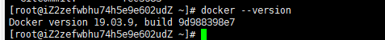
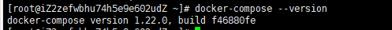
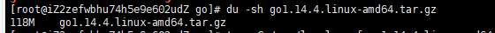
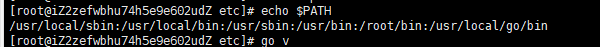
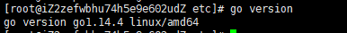

# fabric搭建（一）

## 前言

最近开始学fabric，这几篇博文将记录下，我搭建的过程和出现的一些问题

## 参考连接

https://www.cnblogs.com/aberic/p/7531202.html

https://hyperledger.github.io/fabric-chaincode-java/release-2.2/api/

https://hyperledger-fabric.readthedocs.io/zh_CN/release-2.0/whatis.html


## 环境搭建

### Docker安装

用docker来搭建需要的环境

卸载旧版docker

```
$ sudo yum remove docker \ docker-common \ docker-selinux \ docker-engine
```

安装docker 

参考链接：https://www.runoob.com/docker/ubuntu-docker-install.html

```
$ sudo yum install -y yum-utils device-mapper-persistent-data lvm2

$ sudo yum-config-manager \
    --add-repo \
https://download.docker.com/linux/centos/docker-ce.repo

$ sudo yum-config-manager --enable docker-ce-edge

$ sudo yum-config-manager --enable docker-ce-test

$ sudo yum-config-manager --disable docker-ce-edge

$ sudo yum makecache fast

$ sudo yum install docker-ce
```

查询安装的dockers版本号

```
docker --version
```

运行结果

 

此外还可以设置镜像加速、启动和停止等，此次不做说明

### Docker-Compose

需要使用curl命令下载 docker-compose

下载curl

```
yum install curl
```

安装Compose

参考链接：https://www.runoob.com/docker/docker-compose.html

可以更换1.24.1来安装其他版本

```
$ sudo curl -L "https://github.com/docker/compose/releases/download/1.24.1/docker-compose-$(uname -s)-$(uname -m)" -o /usr/local/bin/docker-compose
```

查看安装好的版本

```
docker-compose --version
```

运行结果

 

关于docker常用命令和dockers-compass的用法可以查看上面的参考链接


### Go语言安装


可以去[go官网](https://golang.org/)查找linux版本的下载路径

安装参考链接：https://www.runoob.com/go/go-environment.html

```
wget https://dl.google.com/go/go1.14.4.linux-amd64.tar.gz
```

查看下好的压缩包大小

```
du -sh go1.14.4.linux-amd64.tar.gz
```

运行截图

 

解压命令

```
tar -C /usr/local -xzf go1.14.4.linux-amd64.tar.gz
```

配置go环境变量

```
# 打开配置文件
vi /etc/profile

# 文件末尾加上
export PATH=$PATH:/usr/local/go/bin
export GOPATH=/opt/gopath
```

修改完成后 执行

```
# 进入etc目录
cd /etc
#使环境变量生效
source profile
```

查看是否生效

```
echo $PATH
```

运行结果

 

查看安装的go版本

```
go version
```

运行结果

 

## 结语

至此farbic需要的基础环境都已搭好