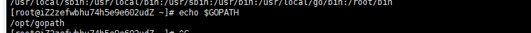
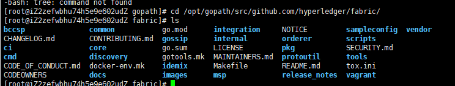
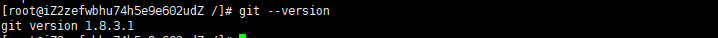

# fabric搭建（二）


## 前言

上一节我们搭建了fabric所需要的基本环境 docker、docker-compose、go语言环境等，今天进行Fabric源码及镜像文件处理

## 参考连接

https://www.cnblogs.com/aberic/p/7532114.html

https://hyperledger.github.io/fabric-chaincode-java/release-2.2/api/

https://hyperledger-fabric.readthedocs.io/zh_CN/release-2.0/whatis.html

## Fabric源码及镜像文件处理

### 下载Fabric源码

首先我们需要去到昨天下的go语言目录，因为下载的fabric列子和工具都需要go的环境

通过命令

```
echo $GOPATH
```

可以查看运行go的位置

运行结果

 


在去到刚刚go的目录

```
cd /opt/gopath
```

接下来需要用git下载源码，可以省事用下面的命令

```
go get github.com/hyperledger/fabric
```

如果没有git环境的话，请跳至[Git安装](###Git安装)

安装好了之后 进入到项目的目录，切换分支  可以根据自己的要求切换分支

```
cd /opt/gopath/src/github.com/hyperledger/fabric/
git checkout -b release-2.2 
```

项目文件结构
 

### Git安装

当你的linux上没有git时，我们需要安装git来完成某些拉取的功能

参考链接：[https://git-scm.com/book/zh/v2/%E8%B5%B7%E6%AD%A5-%E5%AE%89%E8%A3%85-Git](https://git-scm.com/book/zh/v2/起步-安装-Git)

https://www.cnblogs.com/wulixia/p/11016684.html

我采用的yum安装

```
yum -y install git
git --version
```

运行结果
 


### 下载Fabric相关镜像文件

本质上我们可以直接利用在/opt/gopath/src/github.com/hyperledger/fabric/scripts目录下有一个bootstrap-1.0.0.sh脚本文件，事实上如果外网访问条件优越的情况下，直接运行该脚本即可下载所有所需的fabric镜像文件及官方指定所需的二进制文件。

```
cd /opt/gopath/src/github.com/hyperledger/fabric/scripts
./bootstrap.sh 
```

网络不好的情况下考虑下面的做法

利用docker下载fabric镜像

```
#后面的版本号可以不填 默认最新 但是用最新的可能会有pull出错的情况
docker pull hyperledger/fabric-peer:2.2
docker pull hyperledger/fabric-tools:2.2
docker pull hyperledger/fabric-orderer:2.2
docker pull hyperledger/fabric-couchdb:amd64-0.4
docker pull hyperledger/fabric-kafka:amd64-0.4
docker pull hyperledger/fabric-ca:1.4
docker pull hyperledger/fabric-zookeeper:amd64-0.4
docker pull hyperledger/fabric-baseos:2.2
常用镜像
hyperledger/fabric-peer
hyperledger/fabric-tools
hyperledger/fabric-orderer
hyperledger/fabric-couchdb
hyperledger/fabric-kafka
hyperledger/fabric-ca
hyperledger/fabric-zookeeper
hyperledger/fabric-baseos
```

为了方便docker-compose的配置，我们将所有的镜像tag都改为latest，执行如下格式的命令：

```
docker tag IMAGEID(镜像id) REPOSITORY:TAG（仓库：标签）
docker tag 5eb2356665e7 docker.io/hyperledger/fabric-tools:latest
docker tag 760f304a3282 docker.io/hyperledger/fabric-peer:latest
docker tag 5fb8e97da88d docker.io/hyperledger/fabric-orderer:latest
docker tag aa2bdf8013af docker.io/hyperledger/fabric-baseos:latest
docker tag bbcd552150f4 docker.io/hyperledger/fabric-zookeeper:latest
docker tag 7e0396b6d64e docker.io/hyperledger/fabric-kafka:latest
docker tag b967e8b98b6b docker.io/hyperledger/fabric-couchdb:latest
docker tag 743a758fae29 docker.io/hyperledger/fabric-ca:latest
```

